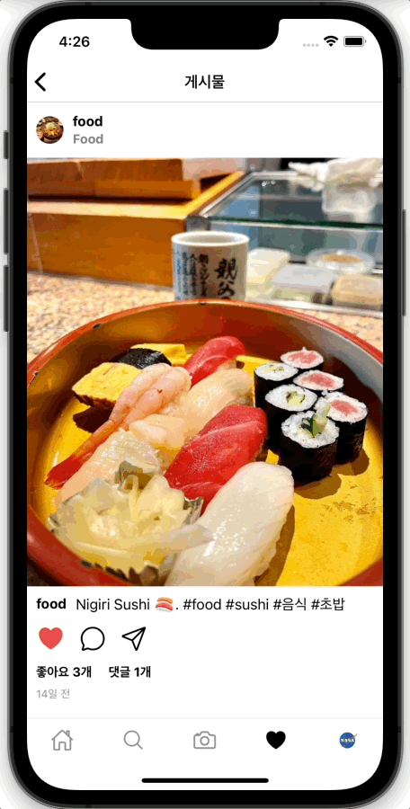

# Capstone Project: Kidsgram

This Capstone project aims to build a platform that resembles Instagram. The objective is to provide a seamless user experience for photo sharing and messaging, with a focus on developing both the front-end and back-end systems to support these interactions.

  <a href="https://instagram-gw.netlify.app">
    
      
    <a display="block" href="https://instagram-gw.netlify.app">https://kidsgram.netlify.app</a>
      
    
  </a>

## Table of Contents
1. [Project Objectives](#project-objectives)
2. [Technologies Used](#technologies-used)
3. [User Features](#user-features)
4. [Project Stages](#project-stages)
5. [User Flow Diagram](#user-flow-diagram)
6. [Built with](#built-with)
7. [Project](#project)
8. [Pages](#pages)
9. [Features](#features)
10. [License](#license)

## Project Objectives
- Enable seamless interaction between users for photo sharing and messaging
- Implement user authentication, profile management, follow/unfollow, photo feed, and message transmission functionality
- Design and build efficient back-end and front-end systems
- Develop the app with cross-platform compatibility for both iOS and Android

## Technologies Used
- Frontend: React, GraphQL, TypeScript, Apollo, Styled Components
- Backend: Apollo Server, GraphQL, Prisma Studio, Prisma Migrate, Prisma Client
- App Development: React Native, Expo, React Navigation

## User Features
1. Sign up and log in
2. Follow/unfollow management
3. Search and upload photos
4. Photo like and comment functionality
5. Personal feed and photo feed
6. Message exchange between users
7. Account settings and profile management

## Project Stages

The project will progress from backend development to web frontend development, followed by app development (for both iOS and Android), and finally, service deployment. 

## User Flow Diagram

The following user flow diagram shows the user experience of the Instaclone web application. The process of a user logging in, using functions such as photo search, uploading, liking, commenting, following/unfollowing, sending messages, etc., and logging out is visually expressed.

## Built with

### Front-end

- `React`
- `Typescript`
- `Apollo Client`
- `Framer Motion`
- `Styled Components`
- `GraphQL Code Generator`

### Back-end

- `NodeJS`
- `Express`
- `Apollo Server`
- `GraphQL`
- `PostgreSQL`
- `Prisma`
- `JsonWebToken`

### App

- `React Native`
- `Expo`
- `Typescript`
- `Apollo Client`
- `React Navigation`
- `Styled Components`
- `GraphQL Code Generator`

### Deploy

- `Netlify`
- `Heroku`
- `AWS S3`

## Project

> 1. User registration, login, logout

- Users can sign up by entering their email, name, username, and password.
- When signing up, the entered password is hashed using Bcrypt, and the account information is stored in PostgreSQL.
- Users can log in by entering their username and password.
- Upon successful login, a JsonWebToken is received and stored in the local storage.
- Update local state using Apollo Client and Reactive variables.
- Updating Reactive variables triggers the update of all queries depending on that variable.
- When logging out, change the Reactive variables, remove the stored token in local storage, and delete the stored data in the store.
-   
- 

> 2. Profile

- In the profile page, users can view their information, photos, followers, and followings.
- Followers are a list of users who follow the user, and followings are a list of users followed by the user.
    
  

> 3. Follow and unfollow users

- Users can follow or unfollow other users.
- When following or unfollowing, the Apollo Client directly modifies the cached field values of both users to update the follower and following lists.
- Once you follow a user, you can see their uploaded photos on the home page.    
- Search users and hashtags
- Search for users with @username (ex: @nasa)
- Search hashtags with #hashtag (ex: #space)
- Using React Hook Form, search for users with @name and hashtags with #hashtag.
    
  

>  4. Search users and hashtags

-Search for users with @username (ex: @nasa)
- Search hashtags with #hashtag (ex: #space)
- Using React Hook Form, search for users with @name and hashtags with #hashtag.
    
  
  
> 5. Photos

- Click on a photo to view its details.
- Animation is applied to the modal window using Framer Motion when it appears and disappears.
- View the user who uploaded the photo, caption, comments, and likes.
- View users who liked the photo and follow or unfollow them.
- Write, edit or delete comments on the photo.
- The user who uploaded the photo can edit the caption or delete the photo.
    
  

> 6. Upload photos
 
- Users can upload photos by entering an image and caption.
- In the caption, include @username or #hashtag to mention a user or create a hashtag.
- The uploaded photo is stored in an AWS S3 bucket.
    
  
  
> 7. Like and unlike photos

- Users can like or unlike photos.
- By liking or unliking a photo, the Apollo Client directly edits the cached field values of the photo to update the likes and total number of likes.
    
  

> 8. Hashtags

- Hashtags display all the photos associated with the hashtag.
- When uploading a photo, a new hashtag is created when #hashtag is entered in the caption.
    
  

> 9. Follow update

- With GraphQL Subscriptions, users can receive follow updates in real-time when someone follows them.
- Using PubSub, following an event is published, and the user listening to that event receives a follow update notification.
    
  

> 10. Dark mode

- Click on the sun or moon to switch between light and dark modes.
- Use the Styled Components ThemeProvider to set light and dark themes.
- When switching to dark mode, the dark mode activation status is saved in the local storage, and the local state is updated using Apollo Client and Reactive variables.
    
  
  
> 11. User registration, login, logout (app)

- Users can sign up by entering their email, name, username, and password.
- Users can log in by entering their username and password.
- Upon successful login, a JsonWebToken is received and stored in AsyncStorage.
- Upon app loading, the token is retrieved from AsyncStorage to verify the login status.
- When logging out, change the Reactive variables, remove the stored token in AsyncStorage, and delete the stored data in the store.
    
  
  
  
> 12. Profile (app)

- In the profile page, users can view their information, photos, followers, and followings.
- Click on a photo to view its details.
- View the user who uploaded the photo, caption, comments, likes, etc.
    
  
  
  
> 13. Photo search, photo selection, and photo shooting (app)

- Search for photos with caption (ex: food)
- Users can select photos from their phone's gallery or upload photos taken through the camera.
- Set access permissions to the media library using expo-media-library.
- Configure the camera's type, zoom, ratio, white balance, etc., using expo-camera.
    
  
  

> 14. Miscellaneous
- Front-end is deployed to Netlify, Back-end is deployed to Heroku.
- Database is deployed to Heroku PostgreSQL.
- Generate types and code from the GraphQL Schema using GraphQL Code Generator.
- Front-end: https://github.com/hoiwonkim/kidsgram-frontend
- Back-end: https://github.com/hoiwonkim/kidsgram-backend
- App: https://github.com/hoiwonkim/kidsgram-app

## Pages

> Root

- Home
- Login
- Register

> User

- All users
- User profile
- User follow
- User followers
- Edit profile

> Photo

- Photo upload
- Photo details

> Hashtag

- Hashtags

## Features

### 🙎‍♂️ User

 - Sign up, delete account
 - Login, log out
 - View profile
 - Follow, unfollow
 - View followers, followings
 - User search
 - Edit profile
 - View all users
 - Follow update

### 📷 Photo

 - View photos
 - View photo likes
 - Upload photos
 - Edit photos
 - Delete photos
 - Search photos
 - View feed

### 💬 Comment
 
 - View comments
 - Create comments
 - Edit comments
 - Delete comments
 - Update comments

### #️⃣ Hashtag
 
 - View hashtags
 - Search hashtags

### ❤️ Like
 - Like and unlike photos
 - Update likes

### 📨 Room
 
 - View all chat rooms
 - View chat room
### ✉️ Message
 
 - Send messages
 - Read messages
 - Delete messages
 - Update messages

### License

MIT
